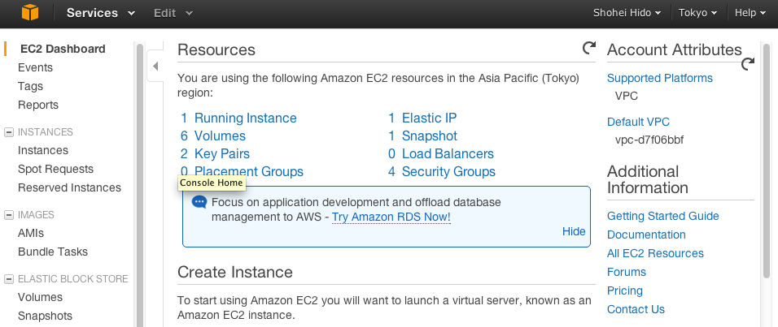
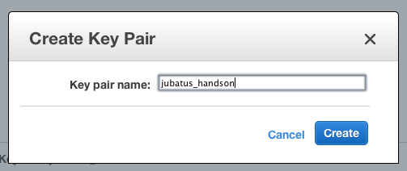
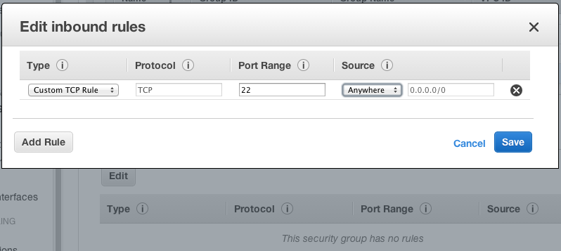
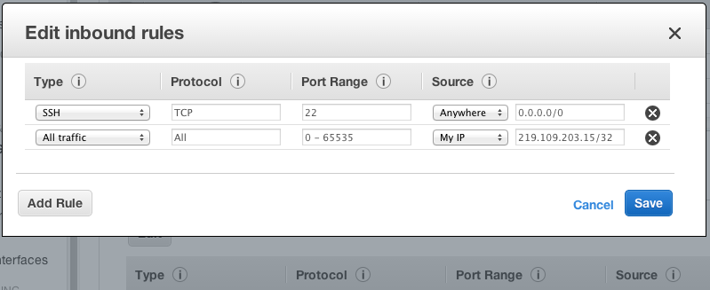
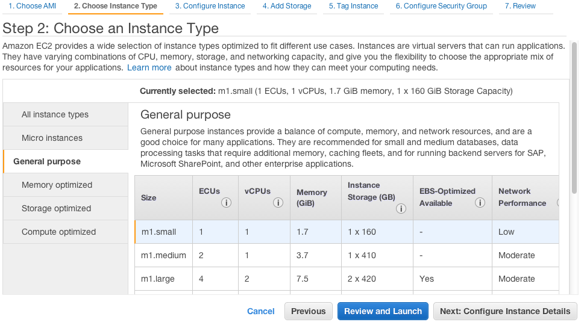
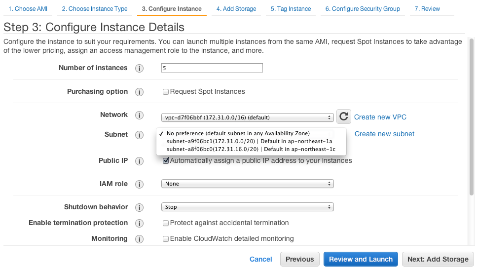
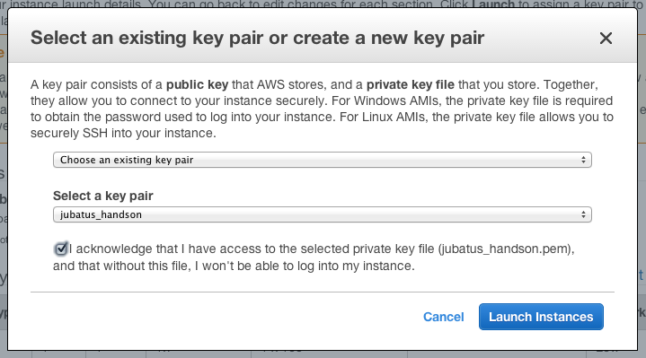

AWSの設定
===============

ハンズオンを始める前に、Amazon web serviceにsign inしてください。以降、すべてAWSに接続されている状態であることを想定します。これから、ハンズオンを実施するにあたって必要な設定を行います。既にAWSを使いこなしている方は、適時設定を飛ばす、読み替える、などしていただいて構いません。

- クーポンによるチャージ：今回のハンズオンでは、アマゾン・ジャパン様のご厚意により、ハンズオンを実施するために十分なクーポンをいただいております。これをチャージして利用します。
- Key Pairの作成：今回のハンズオンでは、今日のハンズオン専用のAMI(Amazon Machine Image)を用います。この仮想マシンにログインするための鍵ペアを作成します。
- Security Groupsの作成、設定：今回のハンズオンは分散環境で動作します。同じ環境同士の通信は自由にできるように、かつ他の環境からは通信できないようにセキュリティグループを設定します。
- ハンズオン用のVMを起動：ハンズオン用のAMIから5台の仮想マシンを起動します。便宜上、``MANAGER``, ``C1``, ``C2``, ``S1``, ``S2`` と名づけます。
- VMへ接続：putty, TeraTerm, などSSHクライアントを用いて、環境に接続します。
 

クーポンによるチャージ
-------------------------
https://portal.aws.amazon.com/gp/aws/manageYourAccount

1. 上部メニュー右、 ``アカウント／コンソール`` のプルダウンメニューから ``アカウント`` を選択
2. 左メニュー中段の ``支払い方法`` を選択
3. 右画面最下部の ``AWS割引クーポンを引き換える`` にある ``AWSクレジットを引き換え／表示`` をクリック
4. 下記の ``クレームコードを入力し、引き換えをクリックしてください。AWSアカウントに支払いを追加します。``  から指定されたコードを入力して ``適用`` ボタンをクリック
5. クーポンが正しくチャージされれば、次のようになります。

.. image:: https://gist.github.com/odasatoshi/d95e62b070c1a679abd4/raw/e04c026e4a696c3345cda31c820436518bc9ff36/payments.png

EC2 ダッシュボード
------------------------
https://console.aws.amazon.com/ec2/v2/home

1. 上記URLをクリック。もし下記画面に飛ばない場合は2に進む
2. 上部メニュー右、アカウント／コンソールから ``AWS マネジメントコンソール`` を選択
3. サービス一覧から ``Compute&Networking`` の中の ``EC2`` をクリック

ここで、現在表示されているURLの末尾が ``region=ap-northeast-?`` となっていることを確認して下さい。
?には1などの数字が入ります。ここが例えば ``us-west`` などになっていると、以下のチュートリアルが実施できないことがあります。
右上の"あなたの名前"と ``Help`` の間にある地名が、 ``Tokyo`` になっていれば大丈夫です。

Key Pairの作成
------------------------
https://console.aws.amazon.com/ec2/home?region=ap-northeast-1#s=KeyPairs

1. ダッシュボードの左側のメニュー  ``NETWORK & SECURITY``  から、 ``Key Pairs`` を選択
2. ``Create Key Pair`` ボタンをクリック
3. ``Key Pair Name`` テキストボックスに ``jubatus_handson`` と入力して ``Create`` ボタンをクリック
4. 自動的に ``jubatus_handson.pem`` というファイルがブラウザでダウンロードされます。

このpemファイルはこれから作るサーバに接続するために必要な秘密鍵です。
後ほど使うターミナルから参照しやすい、例えばホームディレクトリなど適切な場所に保存してください。
Linux, Macなどをお使いの方は、pemファイルのPermissionの設定を変更する必要があります。具体的には

::

    chmod 600 jubatus_handson.pem

を実行しておかないと、後ほどsshクライアントが受け付けてくれません。
（この鍵は新規作成せず、既にあるものを利用しても構いません。）

Security Groupsの作成、設定
-----------------------------
https://console.aws.amazon.com/ec2/home?region=ap-northeast-1#s=SecurityGroups

セキュリティグループとして、 ``jubatus_handson`` を作り、開放するプロトコルとポートの設定を行います。
インターネットからの接続は22番ポート（SSH）のみを許可し、それ以外はすべて接続を拒否します。一方、 ``jubatus_handson`` グループ内に作られた仮想マシンが属するサブネット内（``My IP``）ではすべての通信を許可します。

1. ダッシュボードの左側のメニュー ``NETWORK & SECURITY`` から、 ``Security Groups`` を選択
2. ``Create Security Group`` ボタンをクリック
3. ``Name`` に ``jubatus_handson`` , ``Description`` に適当な説明を入力して ``Create`` ボタンをクリック
4. ダッシュボードに戻って作成した ``jubatus_handson`` グループを選択し、下部から ``Inbound`` タブを選択
5. ``Edit`` ボタンをクリック
6. 現れたダイアログの ``Port Range`` に22を入力、 ``Source`` メニューから ``Anywhere`` を選択

7.  左下隅の `Add Rule`` ボタンをクリック、新しく現れた2行目のruleについて ``Type`` から ``All traffic`` を選択、 ``Source`` メニューから ``My IP`` を選択
8. 2つのルールが正しく表示されているのを確認して右下隅の ``Save`` ボタンをクリック

上記に表示されている ``My IP`` のサブネットはそれぞれの環境によって異なることに注意して下さい。
jubatusには、アクセスコントロール機能はありません。インターネット上で利用する場合は、必ずこういったセキュリティ設定を行ってください。

ハンズオン用のVMを起動
-------------------------
https://console.aws.amazon.com/ec2/home?region=ap-northeast-1#s=Instances

ハンズオン用のAMIから5台の仮想マシンを起動します。
AMIはEC2用の仮想マシンイメージであり、今回の分散ハンズオン用に公開されたイメージを指定して立ち上げます。

1. ダッシュボードの左側のメニュー ``INSTANCES`` から ``Instances`` を選択
2. ``Launch Instance`` ボタンをクリック
3. Step 1: Choose an Amazon Machine Image (AMI) において左側のメニューから4段目の ``Community AMIs`` を選択
4. 右側に現れる検索欄に ``jubatus`` を入力
5. 複数候補が現れる中からタイトルが ``4th_jubatus_handson`` から始まるものを選び、 ``Select`` ボタンをクリック
6. Step 2: Choose an Instance Typeにおいて左側のメニューから3段目の ``General purpose`` を選択
7. 右表1段目の ``m1.small`` を選択肢、 右下隅の ``Next: Configure Instance Details`` ボタンをクリック

8. Step 3: Configure Instance Detailsにおいて``Number of instances:`` が1となっているのを5に変更、 ``Subnet`` が ``No preference (default subnet in any Availability Zone)`` となっているのを ``subnet...Default in ap-northeast-1a`` に変更

9. 設定を省略するため右下隅の ``Next:: Add Storage`` ボタン、 ``Next:: Tag Instance`` ボタン、 ``Next:: Configure Security Group`` ボタンを連続クリック

10. Step 6: Configure Security Groupにおいて ``Assign a security group:`` で ``Select an existing security group`` ラジオボタンを選択

11. 下に表示される ``Security Group ID`` の中から ``Name`` 欄が先ほど作成した ``jubatus_handson`` であるものを探して左端のチェックボックスボタンをクリック

12. 右下隅の ``Review and Launch`` ボタンをクリック、セキュリティ上の警告が表示されるがそのまま右下隅の ``Launch`` ボタンをクリック

13. 確認ダイアログで ``Select a key pair`` が ``jubatus_handson`` になっているのを確認し、その下の確認事項のチェックボックスをオンにして ``Launch Instance`` をクリック

ダッシュボードに戻ってInstancesを見ると、5台のマシンが起動していることがわかると思います。
これからの作業の便宜上、 ``manager`` , ``c1`` , ``c2`` , ``s1`` , ``s2`` と名づけます。空となっている ``Name`` 欄にマウスポンタを持って行くと表示される鉛筆アイコンをクリックして、名前を入力しましょう。
名前が付けられたら、以下のようになります。

.. image:: http://gyazo.com/25770bc23349e386345eb340a109c543.png

この後、ハンズオンで利用するため、 ``manager`` のPrivate IPアドレスを調べておきます。
``manager`` の行をクリックすると、その情報が下部に表示されます。
``description`` タブのまま画面をスクロールさせて、左側中段の ``Private IPs:`` と書かれている所を見てください。
作成した直後の場合、ここが空欄になっている場合がありますが、画面を更新すれば表示されるはずです。
10.X.X.X もしくは 172.31.X.X のようなIPアドレスが書かれているかと思います。これを別の所にメモしておいてください。
同様に、右側上段に ``Public IP:`` を見ると各インスタンスのPublic IPが分かります。これはsshで接続するために使用します。

次にWindowsでputtyを用いる場合を詳細に解説します。それ以外のターミナルや、Mac OSやLinuxをお使いの方は「末尾のWindows以外の場合」を参照して下さい。

managerにssh接続（Windowsの場合）
--------------------------------------------
https://console.aws.amazon.com/ec2/home?region=ap-northeast-1#s=Instances

``manager`` にsshで接続します。先ほどメモしたPrivate IPアドレスではなく、Public IPアドレスの方を指定します。
sshクライアントとしてputtyの使用を仮定します。puttyではなくCygwin等を用いる場合は、この節でなく、Windows以外の場合の節の説明の通りにしてください。
puttyではopenssh形式であるjubatus_handson.pemをそのまま扱えないので、puttygenというツールで変換して用います。

1. ダッシュボードの左側のメニュー ``INSTANCES`` から ``Instances`` をクリック（VMを立ち上げる操作の直後なら必要ない）
2. ``manager`` を選択
3. ``Connect`` ボタンをクリック
4. ダイアログ上部の選択を ``A standalone SSH client`` のままにすると、その下のステップの4番目にPublic IPアドレスが表示される
5. puttyのダウンロードページから ``putty.exe`` と ``puttygen.exe`` をダウンロードする（ダウンロード済みであれば必要ない）
6. ``puttygen.exe`` を実行し、 ``File->"Load private key"`` で ``jubatus_handson.pem`` を開く

.. image:: https://gist.github.com/gwtnb/e5f614edbf58ff9d4ee9/raw/1fc3ceaa7478e584de46cc7143da16b5a25d27a2/puttygen.png

7. ダイアログが開くので ``OK`` をクリックする
8. ``Save public key`` をクリックして、変換された秘密鍵ファイル ``jubatus_handson.ppk`` を保存する
9. ``puttygen.exe`` を閉じる
10. ``putty.exe`` を実行する
11. ``Category:`` の ``Session`` をクリックし、 ``Host Name (or IP address)`` に4で調べたPublic IPアドレスを入力する

.. image:: https://gist.github.com/gwtnb/e5f614edbf58ff9d4ee9/raw/8c82ca13cc01fbf4e7f9d4ad5e4d338ef2168f16/putty_ip.png

12. ``Category:`` の ``Connection/SSH/Auth`` をクリックし、 ``Private key file for authentication`` にjubatus_handson.ppkを指定する

.. image:: https://gist.github.com/gwtnb/e5f614edbf58ff9d4ee9/raw/e392c8fbf9ba47f68f2b5bb6275868b2f937a80b/putty_key.png

13. ``Open`` をクリックするとコンソールが開き、ユーザー名を問われるので ``ubuntu`` と打つと接続できる

managerにssh接続（Windows以外の場合）
-------------------------------------------
https://console.aws.amazon.com/ec2/home?region=ap-northeast-1#s=Instances

``manager`` にsshで接続します。先ほどメモしたPrivate IPアドレスではなく、Public IPアドレスの方を指定します。

1. ダッシュボードの左側のメニュー ``INSTANCES`` から ``Instances`` をクリック（VMを立ち上げる操作の直後なら必要ない）
2. ``manager`` を選択
3. ``Connect`` ボタンをクリック
4. ダイアログ上部の選択を ``A standalone SSH client`` のままにすると、その下のステップの4番目にPublic IPアドレスが表示される
5. ターミナルに移り、 ``ssh -i jubatus_handson.pem ubuntu@<4.で表示されたグローバルIPアドレス>`` と打つと接続できる（pemファイルの場所は適宜読み替える）

pemファイルのパーミッション変更を行っていないと、ここで接続がうまくいかないので注意して下さい。

``manager`` にログインできたら準備完了です。いよいよJubatusの起動に移りましょう。
