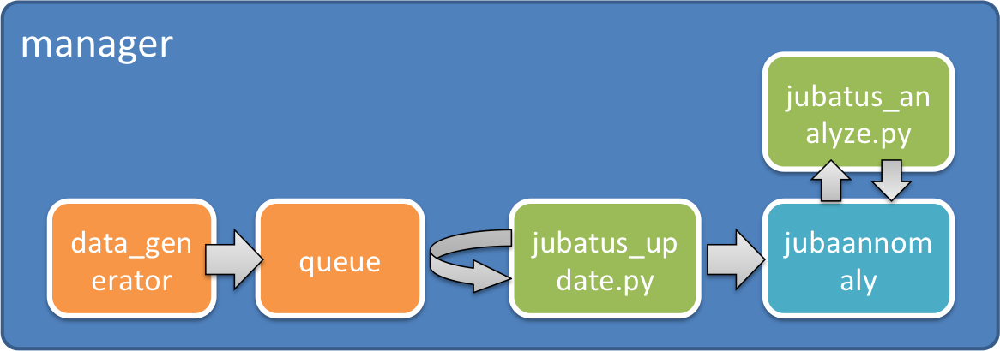
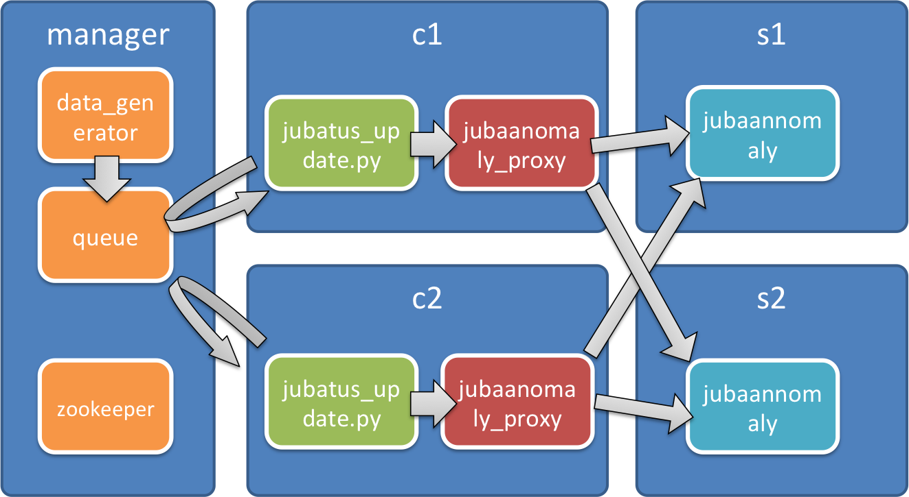

Jubatusを動かしてみる。
==========================

さっそく分散環境で動かしてみましょう。

AMI
-----------------

用意されたVMでは、EC2公式のubuntu 12.04.3 LTSイメージに追加して、主に以下の様なインストールがされています。

::

    $ sudo apt-get install build-essential git zookeeper rabbitmq-server python-pip
    $ git clone https://github.com/jubatus/jubatus-installer.git
    $ jubatus-installer/install.sh -D
    $ git clone https://github.com/odasatoshi/jubatus_distributed_handson.git
    $ sudo pip install jubatus pika==0.9.8

初期設定
-------------

最初に、 ``jubatus_distributed_handson`` ディレクトリに移動します。
以後、すべてこのディレクトリ内で作業をします。

::

    ubuntu@[manager]:~$ cd jubatus_distributed_handson

次に、 ``manager`` 内で、MessageQueueを起動しておきます。

::

    ubuntu@[manager]:~/jubatus_distributed_handson$ sudo sh init_mq.sh 

これは、最初の一回だけで一度起動すれば、マシンを再起動しない限り、ログアウトしても有効です。

``manager`` は、QueueとZookeeperの役割をさせるので、IPアドレス（プライベート）を調べておきましょう。

::

    ifconfig
    eth0      Link encap:Ethernet  HWaddr 12:31:43:01:fc:bc  
              inet addr:10.152.251.74  Bcast:10.152.251.255  Mask:255.255.254.0
              inet6 addr: fe80::1031:43ff:fe01:fcbc/64 Scope:Link
              UP BROADCAST RUNNING MULTICAST  MTU:1500  Metric:1
              RX packets:1951 errors:0 dropped:0 overruns:0 frame:0
              TX packets:1639 errors:0 dropped:0 overruns:0 carrier:0
              collisions:0 txqueuelen:1000 
              RX bytes:147791 (147.7 KB)  TX bytes:235389 (235.3 KB)
              Interrupt:27 

上記のうち、このマシンの場合は、10.152.251.74、今後は、10.X.X.Xと表記します。
サーバのIP（zookeeper, rabbitmq）が必要なのは、このアドレスだけです。

.. raw:: html

    
    プライベートIPを入れると置換します: <input id="privateip" type="text" /><input type="button" value="置換" onclick="OnButtonReplaceClick();"/>

一台構成
----------------

まずは、簡単に一台構成で挙動を確認しましょう。

これから、近傍探索のタスクを題材にハンズオンを行います。センサーからストリーム的にデータが入ってくることを想定してください。これらのデータを一旦Queueで受けながら、逐次データを学習させます。任意の時点で、ある点の近傍探索を行うことが出来、その時点における近傍にある点を見つけることがこのタスクの目的です。

なお、それぞれの役割は以下のようになっています。

- server

  csvデータを登録してデータ生成器として働く

- source.py

  データ生成器からデータを取得してMQにenqueueする。

- jubatus_update.py 10.X.X.X

  10.X.X.Xにあるキューserverから、dequeueして、localhost のjubaanomalyに学習させる。
  jubatus_update.pyからみるとjubaanomalyは必ずlocalhostにあるように見える。
  
- jubatus_analyze.py [id]

  idの近傍を取得する。

一台構成で動かしてみます。
その前に、SSHの接続を増やすか、screen, byobuなどで4つのセッションを確保してください。
よくわからなければ、ターミナルを4つ開いて、それぞれからSSHで接続してください。
ここでは全てのターミナルが ``manager`` に接続して ``jubatus_distributed_handson`` ディレクトリにいると仮定しています。
各シェルで、以下のコマンドを実行します。

* shell1

::

    ubuntu@[manager]:~/jubatus_distributed_handson$ jubaanomaly -f config.json

* shell2

::

    ubuntu@[manager]:~/jubatus_distributed_handson$ ./server

* shell3

::

    ubuntu@[manager]:~/jubatus_distributed_handson$ python source.py --streamname test  --filename test.csv --count 10000

* shell4

::

    ubuntu@[manager]:~$ python jubatus_update.py --host localhost --user jubatus --queue sensor

* shell5

::

    ubuntu@[manager]:~/jubatus_distributed_handson$ python jubatus_analyze.py 

最後のshell5に異常スコアが表示されていると思います。
1.0に近ければ正常、それよりも大きければ大きいほど異常度が高いということになります。
これは、学習している途中なので、結果はタイミングによって変わります。

分散構成
-----------------

次に分散構成を取ります。
まずは、manager上にzookeeperプロセスを立てます。
jubatusは、サーバ同士、およびプロキシプロセス同士の発見、死活監視をzookeeperを介して行っています。
本来、zookeeperをSPoFにしないように3台以上で構成しますが、今回は簡易的に行っています。

::

    ubuntu@[manager]:~$ sudo /usr/share/zookeeper/bin/zkServer.sh start

これまで起動時に指定していたconfigファイルをzookeeperに登録します。

``jubatus_anomaly`` というのが、このタスクの名前です。このタスクは、zookeeper上に一意である必要があります。
jubatusは、この名前が同じもの同士、MIXを行おうとします。

::

    ubuntu@[manager]:~/jubatus_distributed_handson$ jubaconfig -c write -f config.json -t anomaly -n jubatus_anomaly -z 10.X.X.X:2181
    ubuntu@[manager]:~/jubatus_distributed_handson$ jubaconfig -c list -z 10.X.X.X:2181

最終的には以下のプロセス構成になります。

::

    ubuntu@[manager]:~/jubatus_distributed_handson$ python source.py

    ubuntu@[s1]:~/jubatus_distributed_handson$ jubaanomaly --zookeeper 10.X.X.X:2181 -n jubatus_anomaly
    ubuntu@[s2]:~/jubatus_distributed_handson$ jubaanomaly --zookeeper 10.X.X.X:2181 -n jubatus_anomaly

これで、サーバ二台待ち受けている状態になっているはずです。正しくサーバが待ち受けられているかを確認するために、jubactrlを使ってstatusを確認してみましょう。

::

    ubuntu@[manager]:~/jubatus_distributed_handson$ jubactl -z 10.X.X.X:2181 -s jubaanomaly -t anomaly -c status -n jubatus_anomaly
    active jubaproxy members:
    active jubavisor members:
    active jubatus_anomaly members:
    10.XX.XX.XX_9199
    10.XX.XX.YY_9199

``sensor_nn members`` に二台のマシンが登録されているでしょうか？ここで表示されているprivate IPアドレスは、 ``s1`` , ``s2`` のものです。
jubatusはzookeeperを介して自動的にサーバのIPアドレス、ポートを管理します。利用者はzookeeperの場所を意識するだけでよいようになります。
この後、proxyを立ち上げます。

::

    ubuntu@[c1]:~/jubatus_distributed_handson$ jubaanomaly_proxy --zookeeper 10.X.X.X:2181
    ubuntu@[c2]:~/jubatus_distributed_handson$ jubaanomaly_proxy --zookeeper 10.X.X.X:2181

    ubuntu@[c1]:~$ python jubatus_update.py --host 10.X.X.X
    ubuntu@[c2]:~$ python jubatus_update.py --host 10.X.X.X

ここまでで分散できていることを確認しましょう。

::

    ubuntu@[c1]:~/jubatus_distributed_handson$ python jubatus_analyze.py

MIXの影響を見る
-------------------

jubatusのMIXは、最後にMIXが行われてからinterval_countで指定された回数updateを受けるか、
interval_secで指定された時間経過するかのどちらかが契機となって始まります。例えば、下記の設定では5分に一度MIXされます。

::

    jubaanomaly --zookeeper 10.X.X.X:2181 --name jubatus_anomaly --interval_sec 300

source.pyは、seedオプションで、乱数の制御が出来ます。また、speedは毎秒最大していされた個数をenqueueします。countで、
何個投入したら止めるかを指定します。

::

    ubuntu@[manager]:~/jubatus_distributed_handson$ python source.py --seed 1 --speed 5 --count 10000

MIXが起きる前と、起きた後で、結果が変わることを確認して下さい。

::

    ubuntu@[c1]:~/jubatus_distributed_handson$ python jubatus_analyze.py

